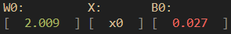
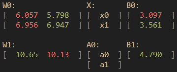
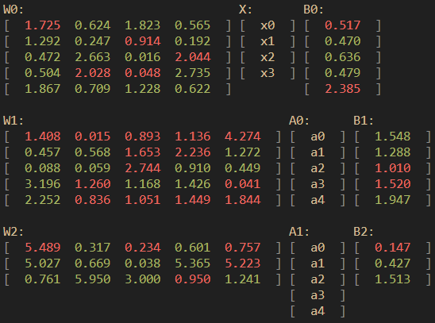

# nn.h (WIP)

###### needs updating...

nn.h is a library that implements a neural network in C. It is meant to be used as a learning tool and nothing more. 

* It can accomodate any number of layers and neurons.
* The framework is designed to be as easy to use as possible.
* It trains the network using gradient descent and backpropagation.

## Usage
```bash
# Compile library to object files.
./nn/compile.sh

# Build and run project.
./build.sh
```

## Example
```C
#include "nn/nn.h"

int main() {
    // Set seed for generating the random weights and biases.
    srand(time(NULL));
    
    // Define the architecture of the neural network in nn.h.
    // ARCH:       [input layer, neurons per layer, ..., output layer]
    // ARCH_FUNCS: [activation function per layer (not counting input layer)]
    // ARCH_LEN:   length of ARCH array.
    NN n = nn_new(ARCH, ARCH_FUNCS, ARCH_LEN);

    // Load set from file.
    Set s = set_from("binary_sum.csv", ",");

    // Train the neural network.
    nn_fit(n, s);

    // Print the neural network and test it's predictions.
    nn_results(n, s);

    // Free memory.
    nn_del(n);
    set_del(s);
    return 0;
}

```

## Activation Functions
The following activation functions are available:

* RELU:    Rectified Linear Unit.
* TANH:    Hyperbolic tangent.
* SIGMOID: Sigmoid function.
* LINEAL:  Lineal function.

```C
// When defining the architecture make sure to use
enum ACT_FUNC { RELU, TANH, SIGMOID, LINEAL };
```

## Configuration
The neural network can be configured in `nn.h` by changing the following variables:

```C
// Neural network architecture.
size_t ARCH[] = { 4, 5, 5, 3 };
// Activation functions per layer (always 1 less than architecture).
ACT_FUNC ARCH_FUNCS[] = { TANH, TANH, SIGMOID };
// Length of ARCH array.
size_t ARCH_LEN = sizeof(ARCH) / sizeof(ARCH[0]);
```
Hyperparameters can be changed in `nn.h`:
```C
// Coefficient for the regularization term.
double LEARNING_RATE = 10e-2;
// Cap for the number of iterations.
size_t MAX_ITER = 10e+4;
// Minimum error for the neural network to stop training.
double MIN_ERROR = 10e-5;
// Batch size for stochastic gradient descent.
size_t BATCH_SIZE = 10;
```

## Models
The following models are available:

* `twice.nn`: Single neuron perceptron that doubles the input.  
  

* `xor.nn`: Multi-layer perceptron that acts as an XOR gate.  
  

* `binary_sum.nn`: Deep neural network that adds two 2 bit binary numbers.  


## Motivation
I wanted to learn how neural networks work and how to implement one, it was never meant to be a perfect implementation as it is not optimized for speed nor memory usage.

## References
* [Tsoding's Neural Network Series](https://youtube.com/playlist?list=PLpM-Dvs8t0VZPZKggcql-MmjaBdZKeDMw)
* [3Blue1Brown's Neural Network Series](https://www.youtube.com/watch?v=aircAruvnKk&list=PLZHQObOWTQDNU6R1_67000Dx_ZCJB-3pi)
